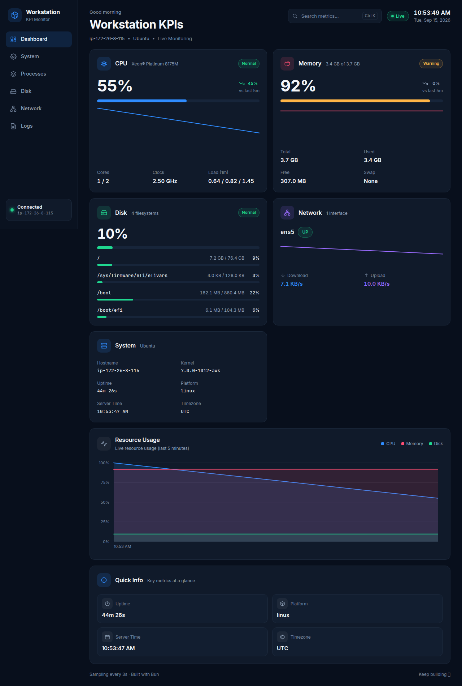

<div align="center">

# Workstation KPIs

**A minimal, dark-mode workstation monitoring dashboard.**
Real-time CPU, memory, disk, network and system metrics — served by a tiny Bun HTTP server with no framework and no build step.

[](https://bun.sh)
[](https://www.typescriptlang.org)
[](https://biomejs.dev)
[](https://bun.sh/docs/cli/test)

</div>



---

## Highlights

- **Live by default** — the browser polls a single JSON endpoint every 3 seconds and re-renders in place.
- **Four-tier semantics** — Normal / Elevated / Warning / Critical with per-resource thresholds, communicated with badges and accents rather than color alone.
- **A real dashboard, not a skeleton** — CPU and memory cards with trends and breakdowns, per-filesystem disk usage, network throughput, and a 5-minute resource chart.
- **Functional codebase** — pure, exported, JSDoc-documented functions. No classes, no mutation, no framework.
- **Zero build step** — Bun serves `public/` directly; the browser loads native ES modules.
- **Accessible** — semantic HTML, ARIA labels, skip link, visible focus states, keyboard shortcuts.

## Tech stack

| Layer | Choice |
|---|---|
| Runtime | [Bun](https://bun.sh) (`Bun.serve`) |
| Metrics | [`systeminformation`](https://systeminformation.io) |
| Backend | TypeScript, no framework |
| Frontend | Vanilla ES modules + `fetch` |
| Styling | Hand-written CSS with BEM and custom properties |
| Tests | `bun test` |
| Lint / format | [Biome](https://biomejs.dev) |

## Quick start

Requires [Bun](https://bun.sh) `>= 1.1`.

```bash
git clone <your-repo-url> workstation-kpi
cd workstation-kpi
bun install
bun run dev
```

Open <http://localhost:3000>.

## Scripts

| Command | Description |
|---|---|
| `bun run dev` | Start the server in watch mode |
| `bun start` | Start the server once |
| `bun test` | Run the unit test suite |
| `bun run typecheck` | Type-check with `tsc --noEmit` |
| `bun run lint` | Biome lint + format check |
| `bun run lint:fix` | Apply safe Biome fixes |
| `bun run format` | Format with Biome |

## Configuration

| Variable | Default | Description |
|---|---|---|
| `PORT` | `3000` | HTTP port the server binds to |

Client-side cadence lives in `public/app.js`: `POLL_INTERVAL_MS` (3s) and `MAX_SAMPLES` (100 samples ≈ 5 minutes of history).

## API

Both endpoints return JSON.

### `GET /api/metrics`

The combined payload rendered by the dashboard.

```jsonc
{
  "timestamp": "2026-09-15T10:53:47.000Z",
  "cpu": {
    "model": "Xeon® Platinum 8175M",
    "cores": 2,
    "physicalCores": 1,
    "speedGhz": 2.5,
    "usagePercent": 55,
    "loadAverage": { "one": 0.64, "five": 0.82, "fifteen": 1.45 },
    "arch": "x64"
  },
  "memory": {
    "total": 3970000000, "used": 3650000000, "free": 322000000,
    "usedPercent": 92, "swapTotal": 0, "swapUsed": 0, "swapUsedPercent": 0
  },
  "disk": {
    "filesystems": [
      { "fs": "/dev/root", "mount": "/", "type": "ext4", "size": 82000000000, "used": 7700000000, "available": 74000000000, "usedPercent": 9 }
    ]
  },
  "network": {
    "interfaces": [
      { "iface": "ens5", "operstate": "up", "rxSec": 7300, "txSec": 10200, "rxTotal": 0, "txTotal": 0, "rxErrors": 0, "txErrors": 0 }
    ]
  },
  "system": {
    "hostname": "ip-172-26-8-115", "distro": "Ubuntu", "platform": "linux",
    "kernel": "7.0.0-1012-aws", "arch": "x64", "uptimeSeconds": 2660,
    "time": "2026-09-15T10:53:47.000Z", "timezone": "UTC"
  }
}
```

### `GET /api/health`

```json
{ "status": "ok" }
```

## Status thresholds

Resource severity is derived on the client from a `[elevated, warning, critical]` tuple:

| Resource | Elevated | Warning | Critical |
|---|---|---|---|
| CPU | ≥ 60% | ≥ 80% | ≥ 90% |
| Memory | ≥ 70% | ≥ 85% | ≥ 95% |
| Disk | ≥ 70% | ≥ 85% | ≥ 95% |

## Project structure

```
workstation-kpi/
├── server.ts               # Bun HTTP server: API routing + safe static file serving
├── src/
│   ├── api.ts              # Composes metrics into one payload; route handler
│   ├── format.ts           # Pure formatting helpers (bytes, percent, uptime)
│   └── metrics/
│       ├── cpu.ts          # Usage, cores, clock, load average
│       ├── memory.ts       # RAM + swap
│       ├── disk.ts         # Filesystem usage
│       ├── network.ts      # Interfaces, bytes/sec
│       └── system.ts       # OS identity, uptime, time
├── public/
│   ├── index.html          # Semantic HTML, inline SVG icon sprite, ARIA
│   ├── styles.css          # BEM styling, dark theme, responsive
│   └── app.js              # Functional client: formatting, charts, polling
├── tests/                  # bun test unit tests for every module
├── artefacts/              # Screenshots and design references
├── biome.json              # Lint / format config
└── tsconfig.json           # Strict TypeScript, checkJs enabled
```

## How it works

1. `server.ts` receives every request, offers it to `handleApi`, and otherwise serves a file from `public/` (with path-traversal protection).
2. `src/api.ts` fans out to the five metric collectors with `Promise.all` and returns one `MetricsPayload`.
3. Each collector splits a **pure transform** (`buildCpuMetrics`, `buildMemoryMetrics`, …) from impure I/O (`getCpuMetrics`, …), so the shape logic is unit-testable without hardware.
4. `public/app.js` polls `/api/metrics`, feeds samples into fixed-size ring buffers, classifies severity, and repaints cards, bars and the resource chart without a full redraw.

## Testing

```bash
bun test          # run the suite
bun run typecheck # tsc --noEmit
bun run lint      # biome check
```

Tests cover formatting helpers, pure metric transforms, API/route behavior, the static file resolver, and the client's classification, chart geometry and buffer logic.

## Design

Dark-mode only and intentionally quiet: a near-black navy base, 1px borders instead of heavy shadows, and a restrained accent palette where color always carries meaning (CPU blue, memory pink/red, disk green, network purple). See [`DESIGN.md`](./DESIGN.md) for the full specification and [`PLAN.md`](./PLAN.md) for the implementation plan.

<div align="center"><sub>Sampling every 3s · Built with Bun</sub></div>
